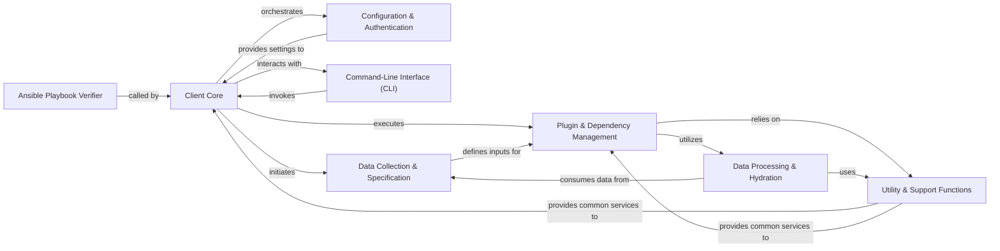

## Component Details

The "Client Application & Orchestration" subsystem is the primary interface and control center for the Insights client. It manages the entire lifecycle of data collection and analysis, from initial configuration and user interaction via the command line, through the intricate process of data gathering based on defined specifications, to the dynamic loading and execution of analysis plugins. It leverages a robust dependency resolution system to ensure that data is processed correctly and efficiently, and provides essential utility functions for tasks like data serialization, error handling, and archive management. This subsystem is responsible for initiating data uploads to Insights services and verifying Ansible playbooks, serving as the comprehensive client-side operational hub.

### Client Core
Manages the overall client-side operations, including data collection initiation, registration with Insights services, data upload, scheduling of tasks, and serves as the primary entry point for running Insights analysis. It also provides command-line utilities for interaction.

**Related Classes/Methods**:

- `insights.client.client` (full file reference)
- `insights.client.core_collector` (full file reference)
- `insights.client.connection` (full file reference)
- `insights.client.schedule` (full file reference)
- `insights.client.archive` (full file reference)
- `insights.client.support` (full file reference)
- `insights.client.phase.v1` (full file reference)
- <a href="https://github.com/RedHatInsights/insights-core/blob/master/insights/collect.py#L170-L275" target="_blank" rel="noopener noreferrer">`insights.collect` (170:275)</a>
- `insights.run` (full file reference)
- `insights.main` (full file reference)
- `insights.process_dir` (full file reference)
- `insights._run` (full file reference)

### Configuration & Authentication
Handles the loading, parsing, and management of client-side configurations, including auto-configuration and certificate authentication settings.

**Related Classes/Methods**:

- `insights.client.config` (full file reference)
- `insights.client.auto_config` (full file reference)
- `insights.client.cert_auth` (full file reference)

### Command-Line Interface (CLI)
Provides the command-line utilities for user interaction, parsing commands, and executing various Insights operations.

**Related Classes/Methods**:

- `insights.command_parser` (full file reference)
- `insights.ocp` (full file reference)
- `insights.ocpshell` (full file reference)
- `insights.shell` (full file reference)
- `insights.tools` (full file reference)

### Data Collection & Specification
Defines and manages rules and specifications for data collection, including what data to collect and how to collect it from various sources.

**Related Classes/Methods**:

- `insights.client.collection_rules` (full file reference)
- `insights.core.spec_factory.SpecFactory` (full file reference)
- `insights.core.spec_factory.foreach_path` (full file reference)
- `insights.core.spec_factory.glob_file` (full file reference)
- `insights.core.spec_factory.simple_file` (full file reference)
- `insights.core.spec_factory.cmd` (full file reference)
- `insights.core.spec_factory.json_file` (full file reference)

### Plugin & Dependency Management
Manages the discovery, loading, registration, and execution order of Insights components (plugins, parsers, combiners) based on their declared dependencies, ensuring correct data flow and analysis execution.

**Related Classes/Methods**:

- `insights.load_default_plugins` (full file reference)
- `insights.load_packages` (full file reference)
- `insights.apply_configs` (full file reference)
- `insights._load_context` (full file reference)
- `insights.load_datasource` (full file reference)
- `insights.load_specs` (full file reference)
- `insights.parse_plugins` (full file reference)
- `insights.parse_specs` (full file reference)
- `insights.core.dr.Broker` (full file reference)
- `insights.core.dr.run` (full file reference)
- `insights.core.dr.get_dependencies` (full file reference)
- `insights.core.dr.mark_failed` (full file reference)
- `insights.core.dr.get_all_dependencies` (full file reference)
- <a href="https://github.com/RedHatInsights/insights-core/blob/master/insights/core/plugins.py#L221-L229" target="_blank" rel="noopener noreferrer">`insights.core.plugins.combiner` (221:229)</a>
- <a href="https://github.com/RedHatInsights/insights-core/blob/master/insights/core/plugins.py#L77-L122" target="_blank" rel="noopener noreferrer">`insights.core.plugins.datasource` (77:122)</a>
- <a href="https://github.com/RedHatInsights/insights-core/blob/master/insights/core/plugins.py#L125-L206" target="_blank" rel="noopener noreferrer">`insights.core.plugins.parser` (125:206)</a>
- <a href="https://github.com/RedHatInsights/insights-core/blob/master/insights/core/plugins.py#L237-L336" target="_blank" rel="noopener noreferrer">`insights.core.plugins.rule` (237:336)</a>
- `insights.core.plugins.get_plugin_metadata` (full file reference)
- `insights.core.plugins.load_plugins` (full file reference)

### Data Processing & Hydration
Provides mechanisms for parsing raw collected data into structured Python objects and making this data accessible within the Insights framework.

**Related Classes/Methods**:

- `insights.core.parsers.Parser` (full file reference)
- `insights.core.parsers.CommandParser` (full file reference)
- `insights.core.parsers.FileParser` (full file reference)
- `insights.core.parsers.JSONParser` (full file reference)
- `insights.core.parsers.get_active_lines` (full file reference)
- `insights.core.hydration.hydrate` (full file reference)
- <a href="https://github.com/RedHatInsights/insights-core/blob/master/insights/core/hydration.py#L47-L61" target="_blank" rel="noopener noreferrer">`insights.core.hydration.create_context` (47:61)</a>

### Utility & Support Functions
Provides various common utility functions, including subprocess execution, data serialization/deserialization, execution context management, exception handling, data filtering, and archive interaction.

**Related Classes/Methods**:

- `insights.client.utilities` (full file reference)
- <a href="https://github.com/RedHatInsights/insights-core/blob/master/insights/client/subp.py#L9-L17" target="_blank" rel="noopener noreferrer">`insights.client.subp` (9:17)</a>
- <a href="https://github.com/RedHatInsights/insights-core/blob/master/insights/core/serde.py#L83-L88" target="_blank" rel="noopener noreferrer">`insights.core.serde.serialize` (83:88)</a>
- <a href="https://github.com/RedHatInsights/insights-core/blob/master/insights/core/serde.py#L91-L96" target="_blank" rel="noopener noreferrer">`insights.core.serde.deserialize` (91:96)</a>
- `insights.core.serde.to_json` (full file reference)
- `insights.core.serde.from_json` (full file reference)
- <a href="https://github.com/RedHatInsights/insights-core/blob/master/insights/core/context.py#L97-L137" target="_blank" rel="noopener noreferrer">`insights.core.context.Context` (97:137)</a>
- <a href="https://github.com/RedHatInsights/insights-core/blob/master/insights/core/context.py#L234-L236" target="_blank" rel="noopener noreferrer">`insights.core.context.HostContext` (234:236)</a>
- `insights.core.context.FSRoot` (full file reference)
- `insights.core.context.DocContext` (full file reference)
- `insights.core.exceptions.InsightsException` (full file reference)
- <a href="https://github.com/RedHatInsights/insights-core/blob/master/insights/core/exceptions.py#L101-L106" target="_blank" rel="noopener noreferrer">`insights.core.exceptions.ContentException` (101:106)</a>
- <a href="https://github.com/RedHatInsights/insights-core/blob/master/insights/core/exceptions.py#L81-L89" target="_blank" rel="noopener noreferrer">`insights.core.exceptions.ParseException` (81:89)</a>
- `insights.core.exceptions.DatasourceWarning` (full file reference)
- <a href="https://github.com/RedHatInsights/insights-core/blob/master/insights/core/filters.py#L56-L133" target="_blank" rel="noopener noreferrer">`insights.core.filters.add_filter` (56:133)</a>
- <a href="https://github.com/RedHatInsights/insights-core/blob/master/insights/core/filters.py#L196-L209" target="_blank" rel="noopener noreferrer">`insights.core.filters.apply_filters` (196:209)</a>
- <a href="https://github.com/RedHatInsights/insights-core/blob/master/insights/core/archives.py#L76-L98" target="_blank" rel="noopener noreferrer">`insights.core.archives.extract` (76:98)</a>
- `insights.core.archives.get_all_files` (full file reference)

### Ansible Playbook Verifier
Component responsible for verifying Ansible playbooks, including serialization aspects.

**Related Classes/Methods**:

- `insights.client.apps.ansible.playbook_verifier` (full file reference)
- `insights.client.apps.ansible.playbook_verifier.serializer` (full file reference)

### [FAQ](https://github.com/CodeBoarding/GeneratedOnBoardings/tree/main?tab=readme-ov-file#faq)