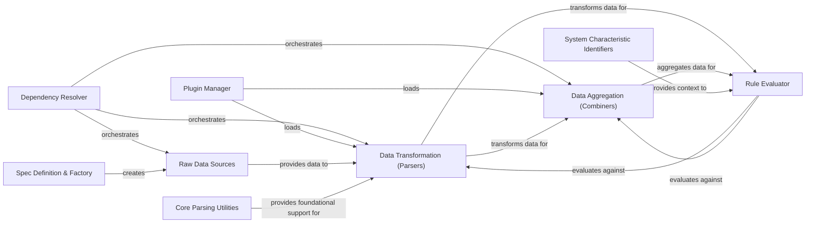

## Component Details

The Data Collection & Processing Engine is the core of the Insights system, responsible for managing component dependencies, loading plugins, and orchestrating the execution of data sources, parsers, and combiners. Its primary purpose is to collect raw system data, transform it into structured objects, aggregate insights, and evaluate these against defined rules to identify system characteristics and potential issues.

### Dependency Resolver
Manages the dependencies between data sources, parsers, and combiners, ensuring they are executed in the correct order. It's crucial for orchestrating the data processing flow.

**Related Classes/Methods**:

- `insights.core.dr` (full file reference)
- `insights.core.dr.run` (full file reference)
- `insights.core.dr.Broker` (full file reference)

### Plugin Manager
Handles the discovery, loading, and management of Insights plugins, which include rules and combiners. It ensures that all available analytical components are ready for execution.

**Related Classes/Methods**:

- `insights.core.plugins` (full file reference)
- `insights.core.plugins.load` (full file reference)
- `insights.core.plugins.Plugin` (full file reference)

### Spec Definition & Factory
Defines the structure and mechanism for creating data source specifications. It's responsible for abstracting how raw data is accessed and prepared for parsing.

**Related Classes/Methods**:

- `insights.core.spec_factory` (full file reference)
- `insights.core.spec_factory.SpecFactory` (full file reference)
- `insights.core.spec_factory.Datasource` (full file reference)

### Raw Data Sources
Provides concrete implementations for collecting raw system data, such as file contents or command outputs. These are the initial points of data acquisition.

**Related Classes/Methods**:

- `insights.specs.datasources` (full file reference)
- <a href="https://github.com/RedHatInsights/insights-core/blob/master/insights/specs/datasources/client_metadata.py#L30-L46" target="_blank" rel="noopener noreferrer">`insights.specs.datasources.client_metadata.ansible_host` (30:46)</a>
- <a href="https://github.com/RedHatInsights/insights-core/blob/master/insights/specs/datasources/yum_updates.py#L259-L338" target="_blank" rel="noopener noreferrer">`insights.specs.datasources.yum_updates.yum_updates` (259:338)</a>

### Data Transformation (Parsers)
Transforms raw text data collected from sources into structured Python objects, making the information easily consumable by other components like combiners and rules.

**Related Classes/Methods**:

- `insights.parsers` (full file reference)
- <a href="https://github.com/RedHatInsights/insights-core/blob/master/insights/parsers/uname.py#L168-L630" target="_blank" rel="noopener noreferrer">`insights.parsers.uname.Uname` (168:630)</a>
- <a href="https://github.com/RedHatInsights/insights-core/blob/master/insights/parsers/installed_rpms.py#L150-L269" target="_blank" rel="noopener noreferrer">`insights.parsers.installed_rpms.InstalledRpms` (150:269)</a>

### Data Aggregation (Combiners)
Aggregates and synthesizes data from multiple parsers or other combiners to create higher-level, more comprehensive data structures, providing a holistic view of system information.

**Related Classes/Methods**:

- `insights.combiners` (full file reference)
- <a href="https://github.com/RedHatInsights/insights-core/blob/master/insights/combiners/ps.py#L61-L301" target="_blank" rel="noopener noreferrer">`insights.combiners.ps.Ps` (61:301)</a>
- <a href="https://github.com/RedHatInsights/insights-core/blob/master/insights/combiners/os_release.py#L254-L372" target="_blank" rel="noopener noreferrer">`insights.combiners.os_release.OSRelease` (254:372)</a>

### System Characteristic Identifiers
Identifies and represents specific characteristics of the analyzed system, such as RHEL version, cloud provider, or SELinux status, which are used by rules and combiners for conditional logic.

**Related Classes/Methods**:

- `insights.components` (full file reference)
- <a href="https://github.com/RedHatInsights/insights-core/blob/master/insights/components/rhel_version.py#L23-L39" target="_blank" rel="noopener noreferrer">`insights.components.rhel_version.IsRhel` (23:39)</a>
- <a href="https://github.com/RedHatInsights/insights-core/blob/master/insights/components/selinux.py#L15-L23" target="_blank" rel="noopener noreferrer">`insights.components.selinux.SELinuxEnabled` (15:23)</a>

### Core Parsing Utilities
Provides a foundational framework with primitives and combinators for building robust and efficient parsers, enabling structured data extraction from various text formats.

**Related Classes/Methods**:

- `insights.parsr` (full file reference)
- `insights.parsr.Parser` (full file reference)
- `insights.parsr.query.Entry` (full file reference)

### Rule Evaluator
Evaluates the collected and processed data against defined rules to identify issues or conditions, forming the analytical core of the Insights system.

**Related Classes/Methods**:

- `insights.core.evaluators` (full file reference)
- `insights.core.evaluators.evaluate` (full file reference)

### [FAQ](https://github.com/CodeBoarding/GeneratedOnBoardings/tree/main?tab=readme-ov-file#faq)