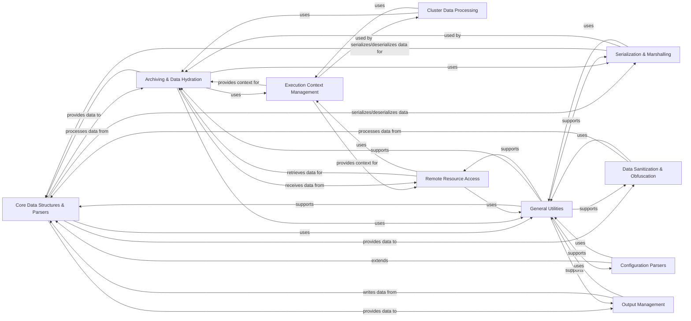

## Component Details

The Data Management & Utilities component of Insights core is responsible for handling fundamental data structures, managing execution contexts, and facilitating data processing, archiving, serialization, and general utility functions. It ensures efficient and secure handling of collected system data, from its initial loading and parsing to its sanitization, serialization, and output.

### Core Data Structures & Parsers
Manages fundamental data structures and provides base classes for parsing various data formats, including text, XML, YAML, and JSON. It defines the interface for how raw system data is transformed into structured Python objects.

**Related Classes/Methods**:

- `insights.core.taglang` (full file reference)
- `insights.core.Parser` (full file reference)
- `insights.core.StreamParser` (full file reference)
- `insights.core.CommandParser` (full file reference)
- `insights.core.ContainerParser` (full file reference)
- `insights.core.XMLParser` (full file reference)
- `insights.core.YAMLParser` (full file reference)
- `insights.core.JSONParser` (full file reference)
- `insights.core.ls_parser` (full file reference)
- `insights.core.Scannable` (full file reference)

### Execution Context Management
Defines and manages the execution environment and state for an Insights run, providing information about the data source (e.g., live system, archive) and overall context for data collection and analysis.

**Related Classes/Methods**:

- `insights.core.context` (full file reference)

### Archiving & Data Hydration
Handles the extraction and loading of raw data from various Insights archive formats (e.g., tar.gz) and makes it accessible for processing.

**Related Classes/Methods**:

- `insights.core.hydration` (full file reference)
- `insights.core.archives` (full file reference)

### Serialization & Marshalling
Manages the conversion of Insights data structures to and from serializable formats, primarily JSON, for storage, transmission, and inter-process communication.

**Related Classes/Methods**:

- `insights.core.marshalling` (full file reference)
- `insights.core.serde` (full file reference)

### Cluster Data Processing
Facilitates the processing and management of data specifically within clustered environments, coordinating with other core components for distributed analysis.

**Related Classes/Methods**:

- `insights.core.cluster` (full file reference)

### Remote Resource Access
Handles the secure and efficient retrieval of data from remote resources, including caching mechanisms to optimize performance.

**Related Classes/Methods**:

- `insights.core.remote_resource` (full file reference)

### General Utilities
A collection of general-purpose utility functions and helper classes used across various parts of the Insights core for common tasks like file system operations, subprocess execution, data manipulation, and hostname resolution.

**Related Classes/Methods**:

- `insights.util.streams` (full file reference)
- `insights.util.component_graph` (full file reference)
- `insights.util.command` (full file reference)
- `insights.util.fs` (full file reference)
- `insights.util.mangle` (full file reference)
- <a href="https://github.com/RedHatInsights/insights-core/blob/master/insights/util/canonical_facts.py#L44-L61" target="_blank" rel="noopener noreferrer">`insights.util.canonical_facts` (44:61)</a>
- `insights.util.specs_catalog` (full file reference)
- `insights.util.subproc` (full file reference)
- `insights.util.content_type` (full file reference)
- `insights.util.file_permissions` (full file reference)
- `insights.util.deprecated` (full file reference)
- `insights.util.word_wrap` (full file reference)
- `insights.util.hostname` (full file reference)

### Data Sanitization & Obfuscation
Implements logic for cleaning and obfuscating sensitive data collected from the system, ensuring data privacy and compliance with security policies.

**Related Classes/Methods**:

- `insights.cleaner` (full file reference)

### Configuration Parsers
Provides specialized parsers and combiners for handling various configuration file formats, enabling structured access to system settings.

**Related Classes/Methods**:

- `insights.core.ConfigComponent` (full file reference)
- `insights.core.ConfigParser` (full file reference)
- `insights.core.ConfigCombiner` (full file reference)
- `insights.core.IniConfigFile` (full file reference)

### Output Management
Manages the writing of processed data and logs to different output destinations, such as text files, log files, and syslog.

**Related Classes/Methods**:

- `insights.core.TextFileOutput` (full file reference)
- `insights.core.LogFileOutput` (full file reference)
- `insights.core.LazyLogFileOutput` (full file reference)
- `insights.core.Syslog` (full file reference)

### [FAQ](https://github.com/CodeBoarding/GeneratedOnBoardings/tree/main?tab=readme-ov-file#faq)