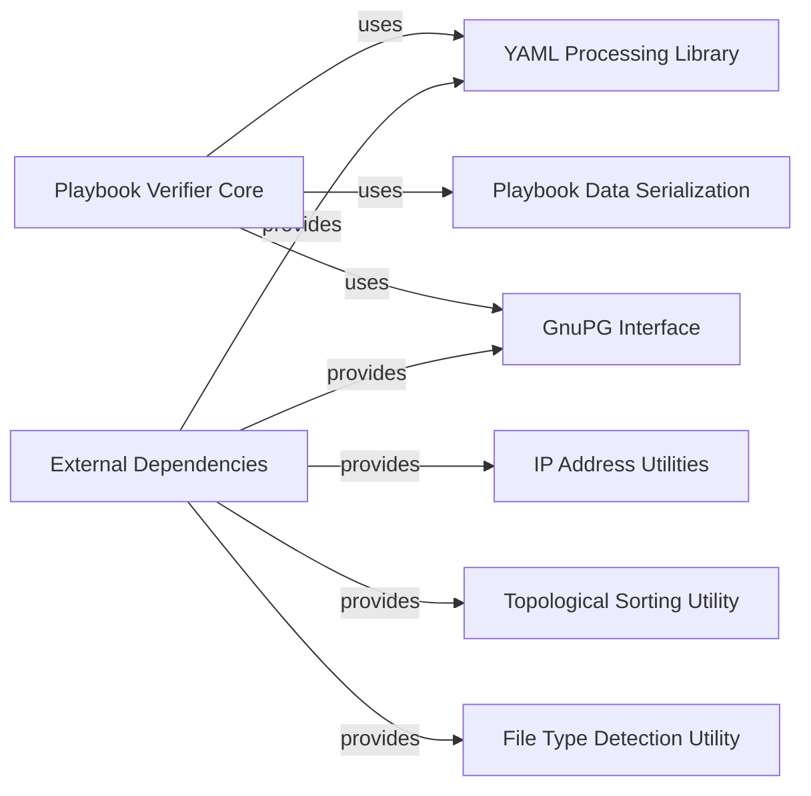

## Component Details

This graph provides an overview of the core components involved in the Insights playbook verification process and the external dependencies it leverages. The main flow involves the Playbook Verifier Core orchestrating the verification, utilizing Playbook Data Serialization, GnuPG Interface, and YAML Processing Library. The External Dependencies component encapsulates various vendored utilities, including those for IP address manipulation, file type detection, and topological sorting, which are provided to other parts of the Insights core.

### Playbook Verifier Core
This component is the central orchestrator for verifying Ansible playbooks. It handles loading playbook YAML, normalizing the data, excluding dynamic elements, hashing the play, retrieving public keys, and executing the GnuPG verification process. It also manages various errors related to playbook verification.

**Related Classes/Methods**:

- `insights-core.insights.client.apps.ansible.playbook_verifier:load_playbook_yaml` (full file reference)
- `insights-core.insights.client.apps.ansible.playbook_verifier:normalize_play_py2` (full file reference)
- `insights-core.insights.client.apps.ansible.playbook_verifier:serialize_play` (full file reference)
- `insights-core.insights.client.apps.ansible.playbook_verifier:get_public_key` (full file reference)
- `insights-core.insights.client.apps.ansible.playbook_verifier:exclude_dynamic_elements` (full file reference)
- `insights-core.insights.client.apps.ansible.playbook_verifier:execute_verification` (full file reference)
- `insights-core.insights.client.apps.ansible.playbook_verifier:verify_play` (full file reference)
- `insights-core.insights.client.apps.ansible.playbook_verifier:get_play_revocation_list` (full file reference)
- `insights-core.insights.client.apps.ansible.playbook_verifier:verify` (full file reference)
- `insights-core.insights.client.apps.ansible.playbook_verifier:PlaybookVerificationError` (full file reference)

### Playbook Data Serialization
This component is responsible for converting Ansible playbook objects into a serializable format, typically a string representation, for hashing and verification purposes. It recursively processes dictionaries, lists, and strings within the playbook structure.

**Related Classes/Methods**:

- <a href="https://github.com/RedHatInsights/insights-core/blob/master/insights/client/apps/ansible/playbook_verifier/serializer.py#L14-L20" target="_blank" rel="noopener noreferrer">`insights-core.insights.client.apps.ansible.playbook_verifier.serializer.PlaybookSerializer:serialize` (14:20)</a>
- <a href="https://github.com/RedHatInsights/insights-core/blob/master/insights/client/apps/ansible/playbook_verifier/serializer.py#L23-L40" target="_blank" rel="noopener noreferrer">`insights-core.insights.client.apps.ansible.playbook_verifier.serializer.PlaybookSerializer._obj` (23:40)</a>
- <a href="https://github.com/RedHatInsights/insights-core/blob/master/insights/client/apps/ansible/playbook_verifier/serializer.py#L79-L92" target="_blank" rel="noopener noreferrer">`insights-core.insights.client.apps.ansible.playbook_verifier.serializer.PlaybookSerializer._dict` (79:92)</a>
- <a href="https://github.com/RedHatInsights/insights-core/blob/master/insights/client/apps/ansible/playbook_verifier/serializer.py#L95-L103" target="_blank" rel="noopener noreferrer">`insights-core.insights.client.apps.ansible.playbook_verifier.serializer.PlaybookSerializer._list` (95:103)</a>
- <a href="https://github.com/RedHatInsights/insights-core/blob/master/insights/client/apps/ansible/playbook_verifier/serializer.py#L43-L76" target="_blank" rel="noopener noreferrer">`insights-core.insights.client.apps.ansible.playbook_verifier.serializer.PlaybookSerializer._str` (43:76)</a>

### GnuPG Interface
This component provides a Pythonic interface to the GnuPG command-line tool, enabling cryptographic operations such as signing, verifying signatures, importing/exporting keys, and managing the GnuPG keyring. It handles subprocess execution and parsing GnuPG output.

**Related Classes/Methods**:

- <a href="https://github.com/RedHatInsights/insights-core/blob/master/insights/client/apps/ansible/playbook_verifier/contrib/gnupg.py#L786-L999" target="_blank" rel="noopener noreferrer">`insights-core.insights.client.apps.ansible.playbook_verifier.contrib.gnupg.GPG` (786:999)</a>
- <a href="https://github.com/RedHatInsights/insights-core/blob/master/insights/client/apps/ansible/playbook_verifier/contrib/gnupg.py#L203-L372" target="_blank" rel="noopener noreferrer">`insights-core.insights.client.apps.ansible.playbook_verifier.contrib.gnupg.Verify` (203:372)</a>
- <a href="https://github.com/RedHatInsights/insights-core/blob/master/insights/client/apps/ansible/playbook_verifier/contrib/gnupg.py#L621-L674" target="_blank" rel="noopener noreferrer">`insights-core.insights.client.apps.ansible.playbook_verifier.contrib.gnupg.Crypt` (621:674)</a>
- <a href="https://github.com/RedHatInsights/insights-core/blob/master/insights/client/apps/ansible/playbook_verifier/contrib/gnupg.py#L485-L522" target="_blank" rel="noopener noreferrer">`insights-core.insights.client.apps.ansible.playbook_verifier.contrib.gnupg.SearchKeys` (485:522)</a>
- <a href="https://github.com/RedHatInsights/insights-core/blob/master/insights/client/apps/ansible/playbook_verifier/contrib/gnupg.py#L524-L595" target="_blank" rel="noopener noreferrer">`insights-core.insights.client.apps.ansible.playbook_verifier.contrib.gnupg.ListKeys` (524:595)</a>
- <a href="https://github.com/RedHatInsights/insights-core/blob/master/insights/client/apps/ansible/playbook_verifier/contrib/gnupg.py#L597-L606" target="_blank" rel="noopener noreferrer">`insights-core.insights.client.apps.ansible.playbook_verifier.contrib.gnupg.ScanKeys` (597:606)</a>
- <a href="https://github.com/RedHatInsights/insights-core/blob/master/insights/client/apps/ansible/playbook_verifier/contrib/gnupg.py#L702-L712" target="_blank" rel="noopener noreferrer">`insights-core.insights.client.apps.ansible.playbook_verifier.contrib.gnupg.ExportResult` (702:712)</a>
- <a href="https://github.com/RedHatInsights/insights-core/blob/master/insights/client/apps/ansible/playbook_verifier/contrib/gnupg.py#L374-L459" target="_blank" rel="noopener noreferrer">`insights-core.insights.client.apps.ansible.playbook_verifier.contrib.gnupg.ImportResult` (374:459)</a>
- <a href="https://github.com/RedHatInsights/insights-core/blob/master/insights/client/apps/ansible/playbook_verifier/contrib/gnupg.py#L471-L476" target="_blank" rel="noopener noreferrer">`insights-core.insights.client.apps.ansible.playbook_verifier.contrib.gnupg.SendResult` (471:476)</a>
- <a href="https://github.com/RedHatInsights/insights-core/blob/master/insights/client/apps/ansible/playbook_verifier/contrib/gnupg.py#L714-L739" target="_blank" rel="noopener noreferrer">`insights-core.insights.client.apps.ansible.playbook_verifier.contrib.gnupg.DeleteResult` (714:739)</a>
- <a href="https://github.com/RedHatInsights/insights-core/blob/master/insights/client/apps/ansible/playbook_verifier/contrib/gnupg.py#L676-L700" target="_blank" rel="noopener noreferrer">`insights-core.insights.client.apps.ansible.playbook_verifier.contrib.gnupg.GenKey` (676:700)</a>
- <a href="https://github.com/RedHatInsights/insights-core/blob/master/insights/client/apps/ansible/playbook_verifier/contrib/gnupg.py#L742-L743" target="_blank" rel="noopener noreferrer">`insights-core.insights.client.apps.ansible.playbook_verifier.contrib.gnupg.TrustResult` (742:743)</a>
- <a href="https://github.com/RedHatInsights/insights-core/blob/master/insights/client/apps/ansible/playbook_verifier/contrib/gnupg.py#L194-L201" target="_blank" rel="noopener noreferrer">`insights-core.insights.client.apps.ansible.playbook_verifier.contrib.gnupg._make_binary_stream` (194:201)</a>
- <a href="https://github.com/RedHatInsights/insights-core/blob/master/insights/client/apps/ansible/playbook_verifier/contrib/gnupg.py#L186-L192" target="_blank" rel="noopener noreferrer">`insights-core.insights.client.apps.ansible.playbook_verifier.contrib.gnupg._make_memory_stream` (186:192)</a>
- <a href="https://github.com/RedHatInsights/insights-core/blob/master/insights/client/apps/ansible/playbook_verifier/contrib/gnupg.py#L170-L175" target="_blank" rel="noopener noreferrer">`insights-core.insights.client.apps.ansible.playbook_verifier.contrib.gnupg._threaded_copy_data` (170:175)</a>
- <a href="https://github.com/RedHatInsights/insights-core/blob/master/insights/client/apps/ansible/playbook_verifier/contrib/gnupg.py#L177-L181" target="_blank" rel="noopener noreferrer">`insights-core.insights.client.apps.ansible.playbook_verifier.contrib.gnupg._write_passphrase` (177:181)</a>
- <a href="https://github.com/RedHatInsights/insights-core/blob/master/insights/client/apps/ansible/playbook_verifier/contrib/gnupg.py#L131-L134" target="_blank" rel="noopener noreferrer">`insights-core.insights.client.apps.ansible.playbook_verifier.contrib.gnupg.no_quote` (131:134)</a>
- <a href="https://github.com/RedHatInsights/insights-core/blob/master/insights/client/apps/ansible/playbook_verifier/contrib/gnupg.py#L183-L184" target="_blank" rel="noopener noreferrer">`insights-core.insights.client.apps.ansible.playbook_verifier.contrib.gnupg._is_sequence` (183:184)</a>

### YAML Processing Library
This component provides comprehensive functionalities for parsing, composing, constructing, and emitting YAML data. It supports various YAML features, including comments, anchors, and different scalar styles, and is used for handling Ansible playbook files.

**Related Classes/Methods**:

- `insights-core.insights.client.apps.ansible.playbook_verifier.contrib.ruamel_yaml.ruamel.yaml.main.YAML` (full file reference)
- `insights-core.insights.client.apps.ansible.playbook_verifier.contrib.ruamel_yaml.ruamel.yaml.main.load` (full file reference)
- `insights-core.insights.client.apps.ansible.playbook_verifier.contrib.ruamel_yaml.ruamel.yaml.main.dump` (full file reference)
- <a href="https://github.com/RedHatInsights/insights-core/blob/master/insights/client/apps/ansible/playbook_verifier/contrib/ruamel_yaml/ruamel/yaml/composer.py#L32-L238" target="_blank" rel="noopener noreferrer">`insights-core.insights.client.apps.ansible.playbook_verifier.contrib.ruamel_yaml.ruamel.yaml.composer.Composer` (32:238)</a>
- `insights-core.insights.client.apps.ansible.playbook_verifier.contrib.ruamel_yaml.ruamel.yaml.emitter.Emitter` (full file reference)
- <a href="https://github.com/RedHatInsights/insights-core/blob/master/insights/client/apps/ansible/playbook_verifier/contrib/ruamel_yaml/ruamel/yaml/parser.py#L95-L778" target="_blank" rel="noopener noreferrer">`insights-core.insights.client.apps.ansible.playbook_verifier.contrib.ruamel_yaml.ruamel.yaml.parser.Parser` (95:778)</a>
- <a href="https://github.com/RedHatInsights/insights-core/blob/master/insights/client/apps/ansible/playbook_verifier/contrib/ruamel_yaml/ruamel/yaml/constructor.py#L57-L350" target="_blank" rel="noopener noreferrer">`insights-core.insights.client.apps.ansible.playbook_verifier.contrib.ruamel_yaml.ruamel.yaml.constructor.BaseConstructor` (57:350)</a>
- `insights-core.insights.client.apps.ansible.playbook_verifier.contrib.ruamel_yaml.ruamel.yaml.representer.BaseRepresenter` (full file reference)
- <a href="https://github.com/RedHatInsights/insights-core/blob/master/insights/client/apps/ansible/playbook_verifier/contrib/ruamel_yaml/ruamel/yaml/resolver.py#L106-L299" target="_blank" rel="noopener noreferrer">`insights-core.insights.client.apps.ansible.playbook_verifier.contrib.ruamel_yaml.ruamel.yaml.resolver.BaseResolver` (106:299)</a>
- <a href="https://github.com/RedHatInsights/insights-core/blob/master/insights/client/apps/ansible/playbook_verifier/contrib/ruamel_yaml/ruamel/yaml/comments.py#L636-L960" target="_blank" rel="noopener noreferrer">`insights-core.insights.client.apps.ansible.playbook_verifier.contrib.ruamel_yaml.ruamel.yaml.comments.CommentedMap` (636:960)</a>
- <a href="https://github.com/RedHatInsights/insights-core/blob/master/insights/client/apps/ansible/playbook_verifier/contrib/ruamel_yaml/ruamel/yaml/comments.py#L382-L512" target="_blank" rel="noopener noreferrer">`insights-core.insights.client.apps.ansible.playbook_verifier.contrib.ruamel_yaml.ruamel.yaml.comments.CommentedSeq` (382:512)</a>
- <a href="https://github.com/RedHatInsights/insights-core/blob/master/insights/client/apps/ansible/playbook_verifier/contrib/ruamel_yaml/ruamel/yaml/events.py#L77-L83" target="_blank" rel="noopener noreferrer">`insights-core.insights.client.apps.ansible.playbook_verifier.contrib.ruamel_yaml.ruamel.yaml.events.StreamStartEvent` (77:83)</a>
- <a href="https://github.com/RedHatInsights/insights-core/blob/master/insights/client/apps/ansible/playbook_verifier/contrib/ruamel_yaml/ruamel/yaml/nodes.py#L68-L86" target="_blank" rel="noopener noreferrer">`insights-core.insights.client.apps.ansible.playbook_verifier.contrib.ruamel_yaml.ruamel.yaml.nodes.ScalarNode` (68:86)</a>
- <a href="https://github.com/RedHatInsights/insights-core/blob/master/insights/client/apps/ansible/playbook_verifier/contrib/ruamel_yaml/ruamel/yaml/scalarstring.py#L24-L57" target="_blank" rel="noopener noreferrer">`insights-core.insights.client.apps.ansible.playbook_verifier.contrib.ruamel_yaml.ruamel.yaml.scalarstring.ScalarString` (24:57)</a>
- <a href="https://github.com/RedHatInsights/insights-core/blob/master/insights/client/apps/ansible/playbook_verifier/contrib/ruamel_yaml/ruamel/yaml/scalarint.py#L14-L90" target="_blank" rel="noopener noreferrer">`insights-core.insights.client.apps.ansible.playbook_verifier.contrib.ruamel_yaml.ruamel.yaml.scalarint.ScalarInt` (14:90)</a>
- <a href="https://github.com/RedHatInsights/insights-core/blob/master/insights/client/apps/ansible/playbook_verifier/contrib/ruamel_yaml/ruamel/yaml/scalarfloat.py#L15-L115" target="_blank" rel="noopener noreferrer">`insights-core.insights.client.apps.ansible.playbook_verifier.contrib.ruamel_yaml.ruamel.yaml.scalarfloat.ScalarFloat` (15:115)</a>
- <a href="https://github.com/RedHatInsights/insights-core/blob/master/insights/client/apps/ansible/playbook_verifier/contrib/ruamel_yaml/ruamel/yaml/timestamp.py#L16-L54" target="_blank" rel="noopener noreferrer">`insights-core.insights.client.apps.ansible.playbook_verifier.contrib.ruamel_yaml.ruamel.yaml.timestamp.TimeStamp` (16:54)</a>

### IP Address Utilities
This component provides classes and functions for working with IPv4 and IPv6 addresses, networks, and interfaces. It includes functionalities for parsing, validating, and manipulating IP addresses and networks, as well as checking their properties (e.g., private, multicast, loopback).

**Related Classes/Methods**:

- `insights-core.insights.contrib.ipaddress:ip_address` (full file reference)
- `insights-core.insights.contrib.ipaddress:ip_network` (full file reference)
- `insights-core.insights.contrib.ipaddress:ip_interface` (full file reference)
- `insights-core.insights.contrib.ipaddress:v4_int_to_packed` (full file reference)
- `insights-core.insights.contrib.ipaddress:v6_int_to_packed` (full file reference)
- `insights-core.insights.contrib.ipaddress:_split_optional_netmask` (full file reference)
- `insights-core.insights.contrib.ipaddress:summarize_address_range` (full file reference)
- `insights-core.insights.contrib.ipaddress:collapse_addresses` (full file reference)
- `insights-core.insights.contrib.ipaddress.IPv4Address` (full file reference)
- `insights-core.insights.contrib.ipaddress.IPv6Address` (full file reference)
- `insights-core.insights.contrib.ipaddress.IPv4Network` (full file reference)
- `insights-core.insights.contrib.ipaddress.IPv6Network` (full file reference)
- `insights-core.insights.contrib.ipaddress.IPv4Interface` (full file reference)
- `insights-core.insights.contrib.ipaddress.IPv6Interface` (full file reference)
- `insights-core.insights.contrib.ipaddress.AddressValueError` (full file reference)
- `insights-core.insights.contrib.ipaddress.NetmaskValueError` (full file reference)
- `insights-core.insights.contrib.ipaddress._TotalOrderingMixin` (full file reference)
- `insights-core.insights.contrib.ipaddress._IPAddressBase` (full file reference)
- `insights-core.insights.contrib.ipaddress._BaseAddress` (full file reference)
- `insights-core.insights.contrib.ipaddress._BaseNetwork` (full file reference)
- `insights-core.insights.contrib.ipaddress._BaseV4` (full file reference)
- `insights-core.insights.contrib.ipaddress._BaseV6` (full file reference)

### Topological Sorting Utility
This component provides functions for performing topological sorting on directed acyclic graphs (DAGs). It is used to flatten a dependency graph into a linear ordering where each node appears before all nodes it precedes.

**Related Classes/Methods**:

- <a href="https://github.com/RedHatInsights/insights-core/blob/master/insights/contrib/toposort.py#L75-L83" target="_blank" rel="noopener noreferrer">`insights-core.insights.contrib.toposort:toposort_flatten` (75:83)</a>
- <a href="https://github.com/RedHatInsights/insights-core/blob/master/insights/contrib/toposort.py#L41-L72" target="_blank" rel="noopener noreferrer">`insights-core.insights.contrib.toposort.toposort` (41:72)</a>

### File Type Detection Utility
This component provides functionalities for identifying file types based on their content, often by using "magic numbers" or other file characteristics.

**Related Classes/Methods**:

- `insights-core.insights.contrib.magic` (full file reference)

### External Dependencies
Encapsulates external libraries or vendored code used by the Insights core for specific functionalities like IP address manipulation, file type detection, and topological sorting.

**Related Classes/Methods**:

- <a href="https://github.com/RedHatInsights/insights-core/blob/master/insights/contrib/toposort.py#L41-L72" target="_blank" rel="noopener noreferrer">`insights-core.insights.contrib.toposort` (41:72)</a>
- `insights-core.insights.contrib.ipaddress` (full file reference)
- `insights-core.insights.contrib.magic` (full file reference)
- `insights-core.insights.client.apps.ansible.playbook_verifier.contrib.gnupg` (full file reference)
- `insights-core.insights.client.apps.ansible.playbook_verifier.contrib.ruamel_yaml` (full file reference)

### [FAQ](https://github.com/CodeBoarding/GeneratedOnBoardings/tree/main?tab=readme-ov-file#faq)