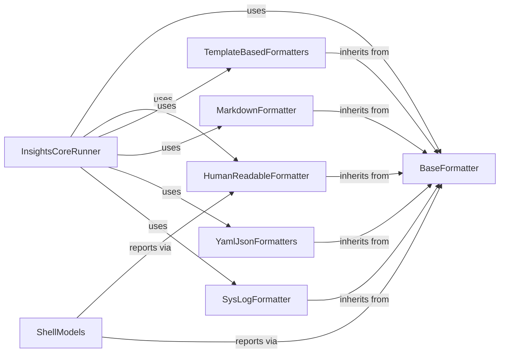

## Component Details

The Reporting & Output subsystem is responsible for transforming the analysis results generated by insights-core into various consumable formats. It leverages a foundational `BaseFormatter` to ensure consistent preprocessing and post-processing across different output types. Specialized formatters, including `HumanReadableFormatter`, `TemplateBasedFormatters` (for HTML and Simple HTML), `MarkdownFormatter`, `YamlJsonFormatters` (for YAML and JSON), and `SysLogFormatter`, handle the specific rendering logic for each format. The `InsightsCoreRunner` orchestrates the overall analysis and utilizes these formatters to present the final results, while `ShellModels` specifically uses formatters for shell-based reporting.

### BaseFormatter
This is the foundational component for all formatters, providing common methods for entering and exiting a formatting context. It ensures that preprocessing and post-processing steps are consistently applied across different output formats.

**Related Classes/Methods**:

- `insights.formats.FormatterAdapterMeta:__init__` (10:11)
- `insights.formats.Formatter:__enter__` (20:21)
- `insights.formats.Formatter:__exit__` (23:24)
- `insights.formats:get_content` (27:30)
- `insights.formats:render` (33:36)

### HumanReadableFormatter
This component is responsible for generating human-readable output summaries of rule hits. It processes and formats data, displays progress, shows tracebacks, lists dropped files, and presents detailed rule descriptions and execution summaries. It acts as a context manager, orchestrating the display of information from the Insights broker.

**Related Classes/Methods**:

- <a href="https://github.com/RedHatInsights/insights-core/blob/master/insights/formats/text.py#L53-L68" target="_blank" rel="noopener noreferrer">`insights.formats.text:render_links` (53:68)</a>
- <a href="https://github.com/RedHatInsights/insights-core/blob/master/insights/formats/text.py#L88-L100" target="_blank" rel="noopener noreferrer">`insights.formats.text.HumanReadableFormat:__init__` (88:100)</a>
- <a href="https://github.com/RedHatInsights/insights-core/blob/master/insights/formats/text.py#L108-L130" target="_blank" rel="noopener noreferrer">`insights.formats.text.HumanReadableFormat:preprocess` (108:130)</a>
- <a href="https://github.com/RedHatInsights/insights-core/blob/master/insights/formats/text.py#L156-L169" target="_blank" rel="noopener noreferrer">`insights.formats.text.HumanReadableFormat:show_dropped` (156:169)</a>
- <a href="https://github.com/RedHatInsights/insights-core/blob/master/insights/formats/text.py#L171-L208" target="_blank" rel="noopener noreferrer">`insights.formats.text.HumanReadableFormat:show_description` (171:208)</a>
- <a href="https://github.com/RedHatInsights/insights-core/blob/master/insights/formats/text.py#L210-L219" target="_blank" rel="noopener noreferrer">`insights.formats.text.HumanReadableFormat:postprocess` (210:219)</a>
- <a href="https://github.com/RedHatInsights/insights-core/blob/master/insights/formats/text.py#L254-L263" target="_blank" rel="noopener noreferrer">`insights.formats.text.HumanReadableFormatAdapter:preprocess` (254:263)</a>
- <a href="https://github.com/RedHatInsights/insights-core/blob/master/insights/formats/text.py#L265-L266" target="_blank" rel="noopener noreferrer">`insights.formats.text.HumanReadableFormatAdapter:postprocess` (265:266)</a>

### TemplateBasedFormatters
This component provides a base for formatters that utilize templates for rendering output, such as HTML and Simple HTML formats. It includes logic for collecting rules, identifying datasources, and creating template contexts, allowing for structured and customizable output generation.

**Related Classes/Methods**:

- <a href="https://github.com/RedHatInsights/insights-core/blob/master/insights/formats/template.py#L37-L54" target="_blank" rel="noopener noreferrer">`insights.formats.template.TemplateFormat:get_datasources` (37:54)</a>
- <a href="https://github.com/RedHatInsights/insights-core/blob/master/insights/formats/template.py#L56-L86" target="_blank" rel="noopener noreferrer">`insights.formats.template.TemplateFormat:collect_rules` (56:86)</a>
- <a href="https://github.com/RedHatInsights/insights-core/blob/master/insights/formats/template.py#L99-L105" target="_blank" rel="noopener noreferrer">`insights.formats.template.TemplateFormat:postprocess` (99:105)</a>
- <a href="https://github.com/RedHatInsights/insights-core/blob/master/insights/formats/simple_html.py#L148-L150" target="_blank" rel="noopener noreferrer">`insights.formats.simple_html.SimpleHtmlFormatterAdapter:preprocess` (148:150)</a>
- <a href="https://github.com/RedHatInsights/insights-core/blob/master/insights/formats/simple_html.py#L152-L153" target="_blank" rel="noopener noreferrer">`insights.formats.simple_html.SimpleHtmlFormatterAdapter:postprocess` (152:153)</a>
- <a href="https://github.com/RedHatInsights/insights-core/blob/master/insights/formats/html.py#L124-L142" target="_blank" rel="noopener noreferrer">`insights.formats.html.HtmlFormat:create_template_context` (124:142)</a>
- <a href="https://github.com/RedHatInsights/insights-core/blob/master/insights/formats/html.py#L149-L151" target="_blank" rel="noopener noreferrer">`insights.formats.html.HtmlFormatterAdapter:preprocess` (149:151)</a>
- <a href="https://github.com/RedHatInsights/insights-core/blob/master/insights/formats/html.py#L153-L154" target="_blank" rel="noopener noreferrer">`insights.formats.html.HtmlFormatterAdapter:postprocess` (153:154)</a>

### MarkdownFormatter
This component is dedicated to generating output in Markdown format. It handles the initialization, processing, and post-processing of data, including displaying tracebacks, dropped files, and rule descriptions, all formatted according to Markdown syntax.

**Related Classes/Methods**:

- <a href="https://github.com/RedHatInsights/insights-core/blob/master/insights/formats/_markdown.py#L38-L62" target="_blank" rel="noopener noreferrer">`insights.formats._markdown.MarkdownFormat:__init__` (38:62)</a>
- <a href="https://github.com/RedHatInsights/insights-core/blob/master/insights/formats/_markdown.py#L82-L90" target="_blank" rel="noopener noreferrer">`insights.formats._markdown.MarkdownFormat:show_tracebacks` (82:90)</a>
- <a href="https://github.com/RedHatInsights/insights-core/blob/master/insights/formats/_markdown.py#L92-L108" target="_blank" rel="noopener noreferrer">`insights.formats._markdown.MarkdownFormat:show_dropped` (92:108)</a>
- <a href="https://github.com/RedHatInsights/insights-core/blob/master/insights/formats/_markdown.py#L110-L163" target="_blank" rel="noopener noreferrer">`insights.formats._markdown.MarkdownFormat:show_description` (110:163)</a>
- <a href="https://github.com/RedHatInsights/insights-core/blob/master/insights/formats/_markdown.py#L165-L178" target="_blank" rel="noopener noreferrer">`insights.formats._markdown.MarkdownFormat:postprocess` (165:178)</a>
- <a href="https://github.com/RedHatInsights/insights-core/blob/master/insights/formats/_markdown.py#L211-L214" target="_blank" rel="noopener noreferrer">`insights.formats._markdown.MarkdownFormatAdapter:preprocess` (211:214)</a>
- <a href="https://github.com/RedHatInsights/insights-core/blob/master/insights/formats/_markdown.py#L216-L217" target="_blank" rel="noopener noreferrer">`insights.formats._markdown.MarkdownFormatAdapter:postprocess` (216:217)</a>

### YamlJsonFormatters
This component encompasses formatters for YAML and JSON output. It focuses on handling results, appending metadata, and retrieving responses in structured data formats, primarily used for machine-readable output.

**Related Classes/Methods**:

- <a href="https://github.com/RedHatInsights/insights-core/blob/master/insights/formats/_yaml.py#L13-L20" target="_blank" rel="noopener noreferrer">`insights.formats._yaml.YamlFormat:__init__` (13:20)</a>
- <a href="https://github.com/RedHatInsights/insights-core/blob/master/insights/formats/_yaml.py#L22-L24" target="_blank" rel="noopener noreferrer">`insights.formats._yaml.YamlFormat:postprocess` (22:24)</a>
- <a href="https://github.com/RedHatInsights/insights-core/blob/master/insights/formats/_json.py#L10-L14" target="_blank" rel="noopener noreferrer">`insights.formats._json.JsonFormat:__init__` (10:14)</a>
- <a href="https://github.com/RedHatInsights/insights-core/blob/master/insights/formats/_json.py#L16-L41" target="_blank" rel="noopener noreferrer">`insights.formats._json.JsonFormat:handle_result` (16:41)</a>
- <a href="https://github.com/RedHatInsights/insights-core/blob/master/insights/formats/_json.py#L43-L45" target="_blank" rel="noopener noreferrer">`insights.formats._json.JsonFormat:postprocess` (43:45)</a>

### SysLogFormatter
This component is responsible for formatting and logging information in a Syslog-compatible format. It handles logging exceptions, rule information, and general preprocessing and post-processing steps for Syslog output.

**Related Classes/Methods**:

- <a href="https://github.com/RedHatInsights/insights-core/blob/master/insights/formats/_syslog.py#L59-L65" target="_blank" rel="noopener noreferrer">`insights.formats._syslog.SysLogFormat:log_exceptions` (59:65)</a>
- <a href="https://github.com/RedHatInsights/insights-core/blob/master/insights/formats/_syslog.py#L67-L72" target="_blank" rel="noopener noreferrer">`insights.formats._syslog.SysLogFormat:show_tracebacks` (67:72)</a>
- <a href="https://github.com/RedHatInsights/insights-core/blob/master/insights/formats/_syslog.py#L74-L86" target="_blank" rel="noopener noreferrer">`insights.formats._syslog.SysLogFormat:log_rule_info` (74:86)</a>
- <a href="https://github.com/RedHatInsights/insights-core/blob/master/insights/formats/_syslog.py#L88-L99" target="_blank" rel="noopener noreferrer">`insights.formats._syslog.SysLogFormat:preprocess` (88:99)</a>
- <a href="https://github.com/RedHatInsights/insights-core/blob/master/insights/formats/_syslog.py#L101-L104" target="_blank" rel="noopener noreferrer">`insights.formats._syslog.SysLogFormat:postprocess` (101:104)</a>
- <a href="https://github.com/RedHatInsights/insights-core/blob/master/insights/formats/_syslog.py#L114-L116" target="_blank" rel="noopener noreferrer">`insights.formats._syslog.SysLogFormatterAdapter:preprocess` (114:116)</a>
- <a href="https://github.com/RedHatInsights/insights-core/blob/master/insights/formats/_syslog.py#L118-L119" target="_blank" rel="noopener noreferrer">`insights.formats._syslog.SysLogFormatterAdapter:postprocess` (118:119)</a>

### InsightsCoreRunner
This is the core execution engine of insights-core. It orchestrates the loading of plugins, components, and configurations, parses specifications, runs the analysis, and manages the overall flow of the Insights process. It's the central point for initiating and controlling the data collection and rule evaluation.

**Related Classes/Methods**:

- `insights.run` (10:11)

### ShellModels
This component handles interactions related to the shell environment, specifically focusing on displaying rule reports. It desugars match/ignore patterns, retrieves rule information, and renders formatted output for shell-based reporting.

**Related Classes/Methods**:

- <a href="https://github.com/RedHatInsights/insights-core/blob/master/insights/shell.py#L686-L712" target="_blank" rel="noopener noreferrer">`insights.shell.Models:show_rule_report` (686:712)</a>

### [FAQ](https://github.com/CodeBoarding/GeneratedOnBoardings/tree/main?tab=readme-ov-file#faq)