```mermaid
graph LR
    Client_Application_Orchestration["Client Application & Orchestration"]
    Data_Collection_Processing_Engine["Data Collection & Processing Engine"]
    Data_Management_Utilities["Data Management & Utilities"]
    Reporting_Output["Reporting & Output"]
    External_Dependencies["External Dependencies"]
    Client_Application_Orchestration -- "initiates analysis" --> Data_Collection_Processing_Engine
    Client_Application_Orchestration -- "orchestrates execution" --> Data_Collection_Processing_Engine
    Client_Application_Orchestration -- "configures data handling" --> Data_Management_Utilities
    Client_Application_Orchestration -- "utilizes core services" --> Data_Management_Utilities
    Client_Application_Orchestration -- "generates reports" --> Reporting_Output
    Client_Application_Orchestration -- "leverages external libraries" --> External_Dependencies
    Data_Collection_Processing_Engine -- "applies data transformations" --> Data_Management_Utilities
    Data_Collection_Processing_Engine -- "manages data structures" --> Data_Management_Utilities
    Data_Collection_Processing_Engine -- "sends processed results" --> Reporting_Output
    Data_Management_Utilities -- "relies on external libraries" --> External_Dependencies
    Reporting_Output -- "uses utility functions" --> Data_Management_Utilities
    click Client_Application_Orchestration href "https://github.com/CodeBoarding/GeneratedOnBoardings/blob/main/insights-core/Client Application & Orchestration.md" "Details"
    click Data_Collection_Processing_Engine href "https://github.com/CodeBoarding/GeneratedOnBoardings/blob/main/insights-core/Data Collection & Processing Engine.md" "Details"
    click Data_Management_Utilities href "https://github.com/CodeBoarding/GeneratedOnBoardings/blob/main/insights-core/Data Management & Utilities.md" "Details"
    click Reporting_Output href "https://github.com/CodeBoarding/GeneratedOnBoardings/blob/main/insights-core/Reporting & Output.md" "Details"
    click External_Dependencies href "https://github.com/CodeBoarding/GeneratedOnBoardings/blob/main/insights-core/External Dependencies.md" "Details"
```

## Component Details

The `insights-core` project provides a robust framework for collecting, processing, and analyzing system data to generate actionable insights. The main flow involves the `Client Application & Orchestration` component initiating data collection and analysis, which is then handled by the `Data Collection & Processing Engine`. This engine processes raw data, transforming it into structured information, often utilizing `Data Management & Utilities` for various data operations and sanitization. Finally, the processed insights are rendered into various formats by the `Reporting & Output` component. All these components may leverage functionalities provided by `External Dependencies`.

### Client Application & Orchestration
Manages the overall client-side operations, including configuration, data collection initiation, registration with Insights services, data upload, scheduling of tasks, and serves as the primary entry point for running Insights analysis. It also provides command-line utilities for interaction and verifies Ansible playbooks.

**Related Classes/Methods**:

- `insights-core.insights.client.client` (full file reference)
- `insights-core.insights.client.config` (full file reference)
- `insights-core.insights.client.schedule` (full file reference)
- `insights-core.insights.client.connection` (full file reference)
- `insights-core.insights.client.archive` (full file reference)
- `insights-core.insights.client.support` (full file reference)
- `insights-core.insights.client.utilities` (full file reference)
- `insights-core.insights.client.cert_auth` (full file reference)
- `insights-core.insights.client.collection_rules` (full file reference)
- `insights-core.insights.client.core_collector` (full file reference)
- <a href="https://github.com/RedHatInsights/insights-core/blob/master/insights/client/subp.py#L9-L17" target="_blank" rel="noopener noreferrer">`insights-core.insights.client.subp` (9:17)</a>
- `insights-core.insights.client.auto_config` (full file reference)
- `insights-core.insights.client.phase.v1` (full file reference)
- <a href="https://github.com/RedHatInsights/insights-core/blob/master/insights/collect.py#L170-L275" target="_blank" rel="noopener noreferrer">`insights-core.insights.collect` (170:275)</a>
- `insights-core.insights.command_parser` (full file reference)
- `insights-core.insights.ocp` (full file reference)
- `insights-core.insights.ocpshell` (full file reference)
- `insights-core.insights.shell` (full file reference)
- `insights-core.insights.run` (full file reference)
- `insights-core.insights.main` (full file reference)
- `insights-core.insights.process_dir` (full file reference)
- `insights-core.insights._run` (full file reference)
- `insights-core.insights.load_default_plugins` (full file reference)
- `insights-core.insights.load_packages` (full file reference)
- `insights-core.insights.apply_configs` (full file reference)
- `insights-core.insights._load_context` (full file reference)
- `insights-core.insights.load_datasource` (full file reference)
- `insights-core.insights.load_specs` (full file reference)
- `insights-core.insights.parse_plugins` (full file reference)
- `insights-core.insights.parse_specs` (full file reference)
- `insights-core.insights.tools` (full file reference)
- `insights-core.insights.client.apps.ansible.playbook_verifier.serializer` (full file reference)
- `insights-core.insights.client.apps.ansible.playbook_verifier` (full file reference)

### Data Collection & Processing Engine
The central engine responsible for managing component dependencies, loading plugins, orchestrating the execution of data sources, parsers, and combiners, and identifying system characteristics. It defines and provides access to raw data, transforms it into structured objects, and aggregates insights.

**Related Classes/Methods**:

- `insights-core.insights.core.dr` (full file reference)
- `insights-core.insights.core.evaluators` (full file reference)
- `insights-core.insights.core.plugins` (full file reference)
- `insights-core.insights.core.spec_factory` (full file reference)
- `insights-core.insights.specs.datasources` (full file reference)
- `insights-core.insights.specs.jdr_archive` (full file reference)
- `insights-core.insights.parsers` (full file reference)
- `insights-core.insights.combiners` (full file reference)
- `insights-core.insights.parsr` (full file reference)
- `insights-core.insights.components` (full file reference)

### Data Management & Utilities
Manages fundamental data structures, execution contexts, archiving, serialization, and cluster-related data processing. It also provides a collection of general-purpose utility functions used across different parts of the Insights core, including data sanitization and obfuscation.

**Related Classes/Methods**:

- `insights-core.insights.core.taglang` (full file reference)
- `insights-core.insights.core.hydration` (full file reference)
- `insights-core.insights.core.context` (full file reference)
- `insights-core.insights.core.marshalling` (full file reference)
- `insights-core.insights.core.archives` (full file reference)
- `insights-core.insights.core.ls_parser` (full file reference)
- `insights-core.insights.core.serde` (full file reference)
- `insights-core.insights.core.cluster` (full file reference)
- `insights-core.insights.core.remote_resource` (full file reference)
- `insights-core.insights.core.exceptions` (full file reference)
- `insights-core.insights.core.Parser` (full file reference)
- `insights-core.insights.core.StreamParser` (full file reference)
- `insights-core.insights.core.ConfigComponent` (full file reference)
- `insights-core.insights.core.ConfigParser` (full file reference)
- `insights-core.insights.core.ConfigCombiner` (full file reference)
- `insights-core.insights.core.CommandParser` (full file reference)
- `insights-core.insights.core.ContainerParser` (full file reference)
- `insights-core.insights.core.XMLParser` (full file reference)
- `insights-core.insights.core.YAMLParser` (full file reference)
- `insights-core.insights.core.JSONParser` (full file reference)
- `insights-core.insights.core.Scannable` (full file reference)
- `insights-core.insights.core.TextFileOutput` (full file reference)
- `insights-core.insights.core.LogFileOutput` (full file reference)
- `insights-core.insights.core.LazyLogFileOutput` (full file reference)
- `insights-core.insights.core.Syslog` (full file reference)
- `insights-core.insights.core.IniConfigFile` (full file reference)
- `insights-core.insights.core.filters` (full file reference)
- `insights-core.insights.util.streams` (full file reference)
- `insights-core.insights.util.component_graph` (full file reference)
- `insights-core.insights.util.command` (full file reference)
- `insights-core.insights.util.fs` (full file reference)
- `insights-core.insights.util.mangle` (full file reference)
- <a href="https://github.com/RedHatInsights/insights-core/blob/master/insights/util/canonical_facts.py#L44-L61" target="_blank" rel="noopener noreferrer">`insights-core.insights.util.canonical_facts` (44:61)</a>
- `insights-core.insights.util.specs_catalog` (full file reference)
- `insights-core.insights.util.subproc` (full file reference)
- `insights-core.insights.util.content_type` (full file reference)
- `insights-core.insights.util.file_permissions` (full file reference)
- `insights-core.insights.util.deprecated` (full file reference)
- `insights-core.insights.util.word_wrap` (full file reference)
- `insights-core.insights.util.hostname` (full file reference)
- `insights-core.insights.cleaner` (full file reference)

### Reporting & Output
Renders the analysis results into various human-readable or machine-readable formats, such as plain text, HTML, Markdown, YAML, JSON, and Syslog.

**Related Classes/Methods**:

- `insights-core.insights.formats` (full file reference)

### External Dependencies
Encapsulates external libraries or vendored code used by the Insights core for specific functionalities like IP address manipulation, file type detection, and topological sorting.

**Related Classes/Methods**:

- <a href="https://github.com/RedHatInsights/insights-core/blob/master/insights/contrib/toposort.py#L41-L72" target="_blank" rel="noopener noreferrer">`insights-core.insights.contrib.toposort` (41:72)</a>
- `insights-core.insights.contrib.ipaddress` (full file reference)
- `insights-core.insights.contrib.magic` (full file reference)
- `insights-core.insights.client.apps.ansible.playbook_verifier.contrib.gnupg` (full file reference)
- `insights-core.insights.client.apps.ansible.playbook_verifier.contrib.ruamel_yaml` (full file reference)

### [FAQ](https://github.com/CodeBoarding/GeneratedOnBoardings/tree/main?tab=readme-ov-file#faq)