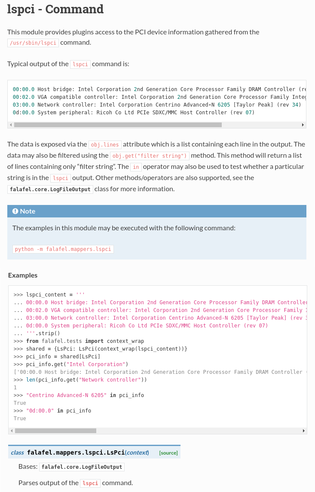

.. _documentation_guidelines:

************************
Documentation Guidelines
************************

Shared Parsers and Combiners that are developed for the insights-core component of
Insights are documented via comments in the code. This makes it easier to
produce documentation that is consistent and up-to-date. The insights-core project
utilizes `Sphinx`_ and `reStructuredText`_ for documentation generation.
Sphinx can create documentation in multiple output formats, and documentation
that can be easily published on websites like `Read The Docs`_. There are a
few simple steps that should be followed by developers when creating or modifying
code to be merged into the insights-core project. First, provide useful comments to
allow a user of your parser to understand what it does and how to use it. Second
follow the style chosen for the insights-core project. And Third, test your docs by
generating them and making sure that they are correct.

This document demonstrates a parser, but combiners may be documented following
the same guidelines and examples.

Goal of Documentation in Code
=============================
The goal of these guidelines is to provide a standard for documentation of insights-core
code.  Having standard for the code documentation (docstrings) makes it more likely
that the code will be used and helps to reduce the number of problems encountered by
developers. Using a standard format for docstrings will also insure that the project
documentation generated from the code will be useful and current with the code.

When adding comments to the code it is desirable to make it easy for a developer to
access.  This means putting the information at the top, in the module section, and
only moving the documentation down into each parser when it is specific to the parser.
For instance if there is only one parser in a module then almost all of the documentation
will be in the module section.  If there are multiple parsers that are very similar then
most of the documentation will be in the module section and only the unique details will
be in each parser's class.

Look at the example code in this article and also review the source files for
these parsers and see how the documentation has been organized.

Example Parser
==============

The insights-core project follows the `Google Docstring Style`_ for docstring comments.
The following code provides an example of how docstring comments should be used
in code contributed to the insights-core project:

.. code-block:: python
    :linenos:

    """
    lspci - Command
    ===============

    This module provides plugins access to the PCI device information gathered from
    the ``/usr/sbin/lspci`` command.

    Typical output of the ``lspci`` command is::

        00:00.0 Host bridge: Intel Corporation 2nd Generation Core Processor Family DRAM Controller (rev 09)
        00:02.0 VGA compatible controller: Intel Corporation 2nd Generation Core Processor Family Integrated Graphics Controller (rev 09)
        03:00.0 Network controller: Intel Corporation Centrino Advanced-N 6205 [Taylor Peak] (rev 34)
        0d:00.0 System peripheral: Ricoh Co Ltd PCIe SDXC/MMC Host Controller (rev 07)

    The data is exposed via the ``obj.lines`` attribute which is a list containing
    each line in the output.  The data may also be filtered using the
    ``obj.get("filter string")`` method.  This method will return a list of lines
    containing only "filter string".  The ``in`` operator may also be used to test
    whether a particular string is in the ``lspci`` output.  Other methods/operators
    are also supported, see the :py:class:`insights.core.LogFileOutput` class for more information.

    Examples:
        >>> pci_info.get("Intel Corporation")
        ['00:00.0 Host bridge: Intel Corporation 2nd Generation Core Processor Family DRAM Controller (rev 09)', '00:02.0 VGA compatible controller: Intel Corporation 2nd Generation Core Processor Family Integrated Graphics Controller (rev 09)', '03:00.0 Network controller: Intel Corporation Centrino Advanced-N 6205 [Taylor Peak] (rev 34)']
        >>> len(pci_info.get("Network controller"))
        1
        >>> "Centrino Advanced-N 6205" in pci_info
        True
        >>> "0d:00.0" in pci_info
        True
    """
    from .. import LogFileOutput, parser
    from insights.specs import Specs

    @parser(Specs.lspci)
    class LsPci(LogFileOutput):
        """Parses output of the ``lspci`` command."""
        pass

One thing to note here is that the output of each example code line is
tested literally against the output given in the documentation.  This means
you cannot split lines, and a dictionary will almost certainly not be listed
in the order you give it.

Docstring Details
=================
`Google Docstring Style`_ is used for specific elements of the docstring, but
generally `reStructuredText`_ is used for all formatting.  The following
subsections describe details of the docstrings in the example code.

Title
-----

.. code-block:: python
    :linenos:

    """
    lspci - Command
    ===============

.. Fix display in editors by terminating the docstring """

The docstring module begins at the first line of the file using three double quotes.
The second line is the name of the module and a descriptive phrase.  In this case
the file is **lspci.py**, the module is **lspci** and it is a command.  An example
of a file parser would be file **fstab.py**, module name **fstab** and descriptive
phrase'File /etc/fstab'.  The module
name line is followed by a line of ``=`` characters that is the same length as the
entire module line.  A blank line follows the module information.

Description
-----------

.. code-block:: python
   :linenos:
   :lineno-start: 4

   This module provides plugins access to the PCI device information gathered from
   the ``/usr/sbin/lspci`` command.

   Typical output of the ``lspci`` command is::

       00:00.0 Host bridge: Intel Corporation 2nd Generation Core Processor Family DRAM Controller (rev 09)
       00:02.0 VGA compatible controller: Intel Corporation 2nd Generation Core Processor Family Integrated Graphics Controller (rev 09)
       03:00.0 Network controller: Intel Corporation Centrino Advanced-N 6205 [Taylor Peak] (rev 34)
       0d:00.0 System peripheral: Ricoh Co Ltd PCIe SDXC/MMC Host Controller (rev 07)

   The data is exposed via the ``obj.lines`` attribute which is a list containing
   each line in the output.  The data may also be filtered using the
   ``obj.get("filter string")`` method.  This method will return a list of lines
   containing only "filter string".  The ``in`` operator may also be used to test
   whether a particular string is in the ``lspci`` output.  Other methods/operators
   are also supported, see the :py:class:`insights.core.LogFileOutput` class for more information.

Next comes the description of the module.
Since this description is the first thing a developer will see when viewing
the documentation it is important that the description is clear, concise and useful.
Include elements of the module that would not be obvious from looking at the code.
This description should provide an overview that complements detail shown in the
*Examples* section.  If there are multiple parsers in the module, this section should
provide a brief description of each parser.  If parser input is similar for each parser
then a code samples can be shown in the module description and/or in the *Examples*.  If
there are important details in the output for each parser then put that information
in the class docstrings instead.  You may use multiple *Examples* sections in the
module description if necessary to fully demonstrate usage of the parser.

Notes/References
----------------

.. code-block:: python
   :linenos:
   :lineno-start: 22

   Note:
       The examples in this module may be executed with the following command:

       ``python -m insights.parsers.lspci``

Module notes and/or references are not necessary unless there is information
that should be included to aid a developer in understanding the parser. In
this particular case this information is only provided as an aid to the
reader of this sample code that the *Examples* section is executable using
``doctest``.  It is not recommended to include this note in any contributed code
regardless of whether the code is ``doctest`` compatible.

Examples
--------

.. code-block:: python
   :linenos:
   :lineno-start: 27

   Examples:
       >>> pci_info.get("Intel Corporation")
       ['00:00.0 Host bridge: Intel Corporation 2nd Generation Core Processor Family DRAM Controller (rev 09)', '00:02.0 VGA compatible controller: Intel Corporation 2nd Generation Core Processor Family Integrated Graphics Controller (rev 09)', '03:00.0 Network controller: Intel Corporation Centrino Advanced-N 6205 [Taylor Peak] (rev 34)']
       >>> len(pci_info.get("Network controller"))
       1
       >>> "Centrino Advanced-N 6205" in pci_info
       True
       >>> "0d:00.0" in pci_info
       True
   """

.. Fix display in editor by terminating docstring """

This section of the documentation is the most important section because of
the information it conveys to the reader.  Make sure to include examples that
show use of the parser to access the facts provided by the parser.  You can
ensure that the examples are accurate by executing them in the Python
interactive shell.  If you implement an *Examples* section including input
data as shown in the above code, you can use the ``doctest`` utility to
execute/test your example documentation.  It is not necessary to include the
input in both the comments and the examples.  Simply refer to the input
samples provide in the *Examples* section from the comments.

Testing your examples
---------------------

To test this documentation automatically, this code should go in the
associated ``tests/test_lspci.py`` file:

.. code-block:: python
    :linenos:

    from insights.parsers import lspci
    from insights.tests import context_wrap
    import doctest

    LSPCI_DOCS_EXAMPLE = '''
    00:00.0 Host bridge: Intel Corporation 2nd Generation Core Processor Family DRAM Controller (rev 09)
    00:02.0 VGA compatible controller: Intel Corporation 2nd Generation Core Processor Family Integrated Graphics Controller (rev 09)
    03:00.0 Network controller: Intel Corporation Centrino Advanced-N 6205 [Taylor Peak] (rev 34)
    0d:00.0 System peripheral: Ricoh Co Ltd PCIe SDXC/MMC Host Controller (rev 07)
    '''

    def test_lspci_documentation():
        env = {
            'lspci': lspci.LsPci(context_wrap(LSPCI_DOCS_EXAMPLE)),
        }
        failed, total = doctest.testmod(lspci, globs=env)
        assert failed == 0

This causes the tests to fail if the documentation examples fail for any
reason.  If that occurs the tests will output detailed information about
problems in execution or the differences between expected and actual output.

Testing Your Docstring
======================

.. note::

   The documentation build is not supported for versions of Python older
   than 2.7.  At least one of the modules needed to render
   the Jupyter notebooks is not supported.  Please build documents using
   a version of Python that is at least 2.7 or greater.

Once you have implemented a parser with the recommended documentation style
you will need to include it in the insights-core documentation.  You can do
this by creating a file in the directory
``insights-core/docs/shared_parsers_catalog/`` that has the same name as your
parser module name, except with a ``.rst`` extension instead of a ``.py``
extension.  For example if your parser module is named ``your_parser.py``
then create a file
``insights-core/docs/shared_parsers_catalog/your_parser.rst`` and include the
following three lines in the file::

   .. automodule:: insights.parsers.your_parser
      :members:
      :show-inheritance:

Once you have created this file, switch to the directory
``insights-core/docs`` and type the following commands to create the HTML
documentation::

    $ make clean
    $ make html_debug

If you have errors in your comments you may see them in the output of the
make command. Sphinx will only report errors if it cannot parse the comments.
If you notice a message similar to the following you may safely ignore it::

  "Didn't find BlockIDInfo.data in insights-core.parser.blkid"

Once the ``make`` command executes without any error messages the next step
is to review the generated HTML and ensure that it looks correct.  The
generated HTML is located in ``insights-core/docs/_build/html/``.  You may
view the files in a browser such as Firefox by executing the following
command from the ``html`` directory::

    $ firefox index.html

If you prefer to view the HTML in a web browser you may also start a basic web server
in the ``html`` directory by executing the following command to run a web server on
port 8000::

    $ python -m SimpleHTTPServer 8000

Once you have verified that the documentation was created correctly, check in your
code and the ``.rst`` file and submit a pull request.

Rendered HTML
=============

The following show how the ``lspci`` module documentation is rendered as HTML.

References
==========
* `Sphinx Docs`_
* List of Docstring headings supported by Sphinx Napoleon `Sphinx Section Names`_
* `reStructuredText Docs`_
* `Google Docstring Style`_
* `Python Doctest Docs`_

.. Put all of the reference links here
.. Links:

.. _Sphinx Docs: http://www.sphinx-doc.org/en/stable/contents.html
.. _Sphinx: http://www.sphinx-doc.org/en/stable/contents.html
.. _reStructuredText Docs: http://www.sphinx-doc.org/en/stable/rest.html
.. _reStructuredText: http://www.sphinx-doc.org/en/stable/rest.html
.. _Google Docstring Style: http://sphinxcontrib-napoleon.readthedocs.io/en/latest/example_google.html
.. _Sphinx Section Names: https://sphinxcontrib-napoleon.readthedocs.io/en/latest/#docstring-sections
.. _Read the Docs: https://readthedocs.org
.. _Python Doctest Docs: https://docs.python.org/2/library/doctest.html
