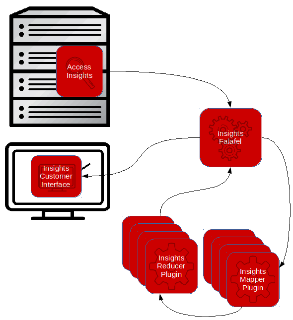

################
Red Hat Insights
################

:Version: |version|
:Date: |today|

.. contents:: Table of Contents
    :depth: 6

************
Introduction
************

The Red Hat Insights application is built upon four somewhat independent
subsystems:

#. the collection component;
#. the processing engine component;
#. the plugin components; and
#. the customer interface component.

The collection component is called Red Hat Insights Client ("Client") and is part
of the
Red Hat Enterprise Linux distribution.  It is installed via RPM onto a host
system where it collects information to send to the infrastructure engine for
analysis.  The processing engine component is called Insights Core ("Engine")
and runs on Red Hat
internal systems to process the information collected by the Client and provides
results to the customer interface component.  The Engine processes the information
by extracting each unique set of data, parsing the data into facts,
and analyzing the facts via algorithms.  Parsing and analysis of the information
is performed in a collection of plugin components.  The parsing and combining
is performed by the Parser and Combiner plugins, and the analysis is performed by
Rule plugins (collectively "Plugins"). The results of the analysis
are presented to the user via the user interface component ("UI").  The figure
below provides a graphical overview of the components and the information flow.

Overview of the Insights Components and Information Flow

Insights Client - Collection
============================

Collection of information is performed by the Client component of Red Hat Insights.
The Client RPM is installed on one or more host systems where data collection is to
be performed. A host system may be a physical system or a virtual machine.
Information collected by the Client is filtered to remove sensitive information
and then sent to the Engine for analysis.  Collection is typically performed
daily but may be configured to run on other schedules.  It may also be
disabled/enabled by the system administrator.

.. todo:: TODO: Include info about archives for Satellite and virtual machines.

.. todo:: TODO: Include info about types of data collected, for example the spec
   types such as command spec, filespec, etc.

More information about the
Client component can be found at `Red Hat Insights Portal`_ and source code is
available on the `Red Hat Insights Client GitHub Project`_.

Red Hat Insights Core - Data Analysis Engine
============================================

Once host information has been collected by the Client it is transferred to
the Engine for processing.  The Engine is a SaaS application hosted at Red Hat.
The Engine processes information as it is received and provides the results
to the Customer Interface for review by the customer.

The Engine begins processing by unarchiving the information
and identifying each type of information that included in the Client upload.
The Engine then configures the Plugins into a
map/reduce network and executes them to analyze the data.
The workflow consists of the steps:

1. parsing the data into facts specific to the system (such as RPMS installed,
   CPU details, storage details, etc.);
2. combining certain facts where there are multiple sources, or differences
   across platforms (this provides a more consistent set of facts for the
   analysis step); and
3. analyzing the facts to determine the results.

Each Plugin provides results which are all collected by the Engine and
upon job completion the results are made available to the Customer
Interface for review. The Engine evaluates the input data and only invokes
Plugins that are necessary to process the data that is present. The Engine
also optimizes the Rules so that they are only invoked in the workflow
if the necessary facts are present.

More information about the Red Hat Insights Core component can be found on
`Red Hat Insights Core GitHub Project`_.

Plugin Components - Parsing and Fact Analysis
=============================================

The Engine coordinates analysis of the information via the Plugins. There
are three types of plugins that are used in the analysis workflow, Parsers,
Combiners, and Rules.  Parsers parser data into facts.  Combiners aggregate
facts into higher level facts.  Rules analyze facts.

Parser Plugins
--------------

Parser plugins are responsible for analyzing the raw data
and converting it into usable *facts* that can be evaluated by the
Combiners and Rules.  Each Parser plugin is typically responsible
for parsing a specific set of data.  For instance, the **Mount** parser
plugin (:py:class:`insights.parsers.mount.Mount`)
parses the output of the `mount` command and the **FSTab**
parser plugin (:py:class:`insights.parsers.fstab.FSTab`)
parses the contents of the `/etc/fstab/` file.

Combiner Plugins
----------------

Combiner plugins perform aggregation of facts to make the facts more consistent
to Rules.  For instance the Red Hat Enterprise Linux release number (i.e. 6.8 or 7.3)
is available
in the file `/etc/redhat_release` and may also be derived from the command
`uname -a`.  The **redhat_release** Combiner plugin
(:py:func:`insights.combiners.redhat_release`) looks at the facts from
both Parsers (:py:class:`insights.parsers.redhat_release.RedhatRelease` and
:py:class:`insights.parsers.uname.Uname`) to determine the major and minor release
numbers.  The Combiner will use the best source of information first, and then
use the second source if the first is not available.  This allows Rules to
simply rely on this Combiner as the source of the fact instead of having
to look at the facts from two different Parsers.

Rule Plugins
------------

Rule plugins perform the analysis of the facts made available by the Parsers
and Combiners.  Rules may look at any number of facts to determine if a
symptom or condition is present in a system, or that one is likely to occur
in the future.  For instance if particular ssh vulnerability is present
when using Red Hat Enterprise Linux 7.1 with a particular setting in
file `/etc/ssh/sshd_config`, a Rule could look at the facts from the Red Hat Release
Combiner to determine if the system was running 7.1 and then check
facts from the `sshd_config` file to determine if the setting was present.
If both facts are true then the Rule will report the results and it
will be displayed with information regarding the vulnerability and
how it can be resolved on the specific system. These results from
all Rules are accumulated and consolidated by the Engine to provide to the
Customer Interface.

Customer Interface - Analysis Results
=====================================

The Customer Interface provides views of the Insights results via the
`Red Hat Customer Portal`_. Multiple views are provided for all
of customer's systems reporting to Insights.  Information is provide
regarding the results including metadata related to the findings,
an explanation of the findings, and information related to correction
of identified conditions and/or problems.  The Customer Interface provides
many customization options to optimize each customer's specific needs.

.. --------------------------------------------------------------------
.. Put all of the references that are used throughout the document here
.. Links:

.. _Red Hat Customer Portal: https://access.redhat.com
.. _Red Hat Insights Portal: https://access.redhat.com/products/red-hat-insights.
.. _insights-core Repository: https://github.com/RedHatInsights/insights-core
.. _Mozilla OpenSSH Security Guidelines: https://wiki.mozilla.org/Security/Guidelines/OpenSSH
.. _Red Hat Insights Client GitHub Project: http://github.com/redhataccess/insights-client
.. _Red Hat Insights Core GitHub Project: http://github.com/RedHatInsights/insights-core
